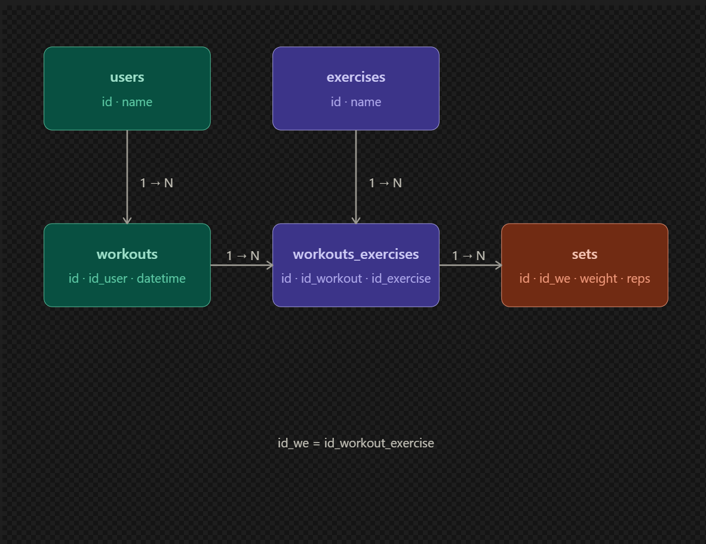

# Gym API

API REST para registro e acompanhamento de treinos — evolução do [Gym Register](https://github.com/Renanmrqs/Gym-Register), que saiu de um CLI simples pra uma API com autenticação, banco relacional na nuvem e arquitetura modular.

🔗 [Documentação interativa (Swagger)](https://gym-api-08pc.onrender.com/docs#/)

---

## Stack

- **FastAPI** — framework principal
- **SQLAlchemy ORM** — mapeamento objeto-relacional
- **PostgreSQL** hospedado no **Neon** — banco na nuvem
- **JWT + Argon2** — autenticação e hashing de senhas (padrão OWASP)
- **Deploy** no Render com variáveis de ambiente

---

## Arquitetura

app/
├── crud/            # operações no banco separadas por recurso
│   ├── exercises.py
│   ├── users.py
│   └── workouts.py
├── routers/         # rotas separadas por recurso
│   ├── exercises.py
│   ├── users.py
│   └── workouts.py
├── auth.py          # lógica de autenticação JWT
├── database.py      # conexão e sessão SQLAlchemy
├── models.py        # modelos ORM (tabelas)
└── schemas.py       # schemas Pydantic (validação)

---

## Rotas

**Autenticação:**
- `POST /register`
- `POST /login`

**Exercises:**
- `GET /exercises`
- `GET /exercises/{id}`
- `POST /exercises` 🔒

**Workouts:**
- `GET /workout_detail_w_workout/{id_workout}` 🔒
- `GET /workout_detail_w_user/{id_user}` 🔒
- `GET /history/{name_user}` 🔒
- `POST /workout` 🔒
- `POST /workout_exercise` 🔒
- `POST /sets` 🔒

🔒 requer token Bearer

---

## Banco de dados

Schema relacional com 5 tabelas — `users`, `exercises`, `workouts`, `workouts_exercises`, `sets`.

---

## Próximos passos

- [✅] Alembic para versionamento de migrations
- [✅] Sistema de logout completo
- [] Testes automatizados com pytest
- [] Melhorar Integração com o [Gym App](https://github.com/Renanmrqs/Gym-App) 
